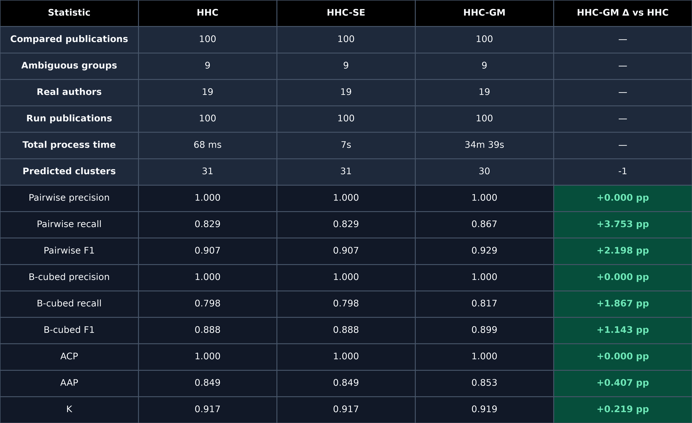

# Heuristic-Based Hierarchical Clustering Disambiguation (HHC)

[**Heuristic-based Hierarchical Clustering (HHC)**](./src/hhc.py) for
**Author Name Disambiguation (AND)**. Given bibliographic records containing an ambiguous
author name, coauthors, a publication title, and a venue, the algorithm groups records that
are likely to belong to the same real person.

## Method

HHC has two clustering stages:

1. **Name and coauthor stage**
   - Normalize author and coauthor names.
   - Process longer author-name forms before abbreviated forms.
   - Put compatible author names in the same cluster when they share a
     compatible coauthor.
2. **Title and venue stage**
   - Remove stop words and stem title and venue terms.
   - Calculate cosine similarity between cluster-level term counts.
   - Repeatedly merge compatible-name clusters when either their title or venue
     similarity exceeds its configured threshold.

The dataset includes the focal author in the `coauthors` list. The implementation
removes that author before looking for a shared coauthor.

## Input format

The input must be a UTF-8 CSV file with these columns:

| Column | Description |
|---|---|
| `ambiguous_name` | Blocking key identifying records that may refer to the same author name. |
| `paper_id` | Publication identifier, such as a DOI. |
| `author_name` | Author-name form appearing on the publication. |
| `coauthors` | List of author names. |
| `title` | Publication title. |
| `venue` | Journal or conference name. It may be empty. |
| `label` | Ground-truth author identity used only for evaluation. |

## Dataset

[LAGOS-AND](https://zenodo.org/records/7313353) dataset, available in `data/lagosandv1_test.csv` contains 191,745 records with 9,950 ambiguous groups.

## Running HHC

Run the complete dataset with the default parameters:

```bash
python src/hhc.py data/lagosandv1_test.csv
```

This creates:

- `outputs/hhc_predictions.csv`
- `outputs/hhc_metrics.json`

Command-line options:

```text
hhc.py        input
              [-h] [-o OUTPUT] 
              [--metrics-output METRICS_OUTPUT]
              [--title-threshold TITLE_THRESHOLD]
              [--venue-threshold VENUE_THRESHOLD]
              [--limit LIMIT]
              [--no-progress]
```

| Option | Default | Purpose |
|---|---|---|
| `input` | — | Input CSV path. |
| `-o`, `--output` | `outputs/hhc_predictions.csv` | Prediction CSV path. |
| `--metrics-output` | `outputs/hhc_metrics.json` | Evaluation-summary JSON path. |
| `--title-threshold` | `0.30` | Minimum title cosine similarity for merging. |
| `--venue-threshold` | `0.50` | Minimum venue cosine similarity for merging. |
| `--limit N` | All records | Process only the first `N` records. |
| `--no-progress` | Off | Disable `tqdm` progress bars. |

Thresholds must be between 0 and 1.

## Outputs

The prediction CSV contains:

```text
paper_id,ambiguous_name,label,predicted_cluster
```

Cluster identifiers have the form:

```text
<ambiguous_name>::<cluster_number>
```

If the input contains `label`, the metrics JSON reports:

- number of records, ambiguous groups, true authors, and predicted clusters;
- pairwise precision, recall, and F1;
- B-cubed precision, recall, and F1;
- average cluster purity (ACP), average author purity (AAP), and
  `K = sqrt(ACP × AAP)` metric, calculated per ambiguous group and
  macro-averaged as in the paper;
- title and venue thresholds used for the run;
- total runtime in seconds, including input parsing, clustering, evaluation, and outputs-file writing.

If `label` is absent, predictions are still generated, but supervised evaluation
metrics are omitted.

## Heuristic-Based Hierarchical Clustering with Semantic Evidence (HHC-SE)
 
[**HHC-SE**](./src/hhc_se.py) is semantic-evidence extension of HHC. The HHC-SE pipeline:

1. runs the same HHC name/coauthor first stage;
2. runs the same title and venue merge rules;
3. additionally merges compatible-name clusters when their pretrained semantic embedding cosine similarity exceeds a semantic threshold.

The current implementation uses the pretrained
[`CLAUSE-Bielefeld/SemCSE_cosine`](https://huggingface.co/CLAUSE-Bielefeld/SemCSE_cosine)
model with the official final-layer `[CLS]` pooling. Each model input is:

```text
Title: <publication title>
Venue: <publication venue>
```
Downloaded Hugging Face files are stored under `./models` by default.
The extensed parameters are:

| Option | Default | Purpose |
|---|---|---|
| `--semantic-threshold` | `0.80` | Minimum SemCSE cluster cosine for a semantic merge. |
| `--model` | `CLAUSE-Bielefeld/SemCSE_cosine` | Hugging Face model identifier. |
| `--model-cache` | `models` | Directory for downloaded Hugging Face model files. |
| `--batch-size` | `16` | Transformer inference batch size. |
| `--max-length` | `256` | Maximum input token count. |
| `--device` | `auto` | Use CUDA when available, otherwise CPU. |
| `--embedding-cache` | `outputs/semcse_cosine_embeddings.pt` | Cached half-precision embeddings. |

## Heuristic-Based Hierarchical Clustering with Generative LLM extension (HHC-GM)

[**HHC-GM**](./src/hhc_gm.py) is a separate extension built directly on top
of classic HHC. It first runs both classic HHC stages. A local instruction-tuned
generative model then judges compatible-name cluster pairs that remain separate.
The ground-truth `label` is never sent to the model.

The default model is
[`HuggingFaceTB/SmolLM2-1.7B-Instruct`](https://huggingface.co/HuggingFaceTB/SmolLM2-1.7B-Instruct).

```bash
python src/hhc_gm.py data/lagosandv1_test.csv \
  --limit 100 \
  --device auto \
  --no-progress
```

For each proposed pair, the model receives a bounded, label-free JSON summary
containing author-name forms, paper identifiers, coauthors, titles, and venues.
It must return a JSON decision with `same_author`, `confidence`, and a short
reason. A merge requires both compatible names and confidence at or above the
configured threshold. If the model still returns malformed output after all
retries, HHC-GM records the responses in its audit cache, conservatively leaves
the clusters separate, and continues processing.

| Option | Default | Purpose |
|---|---|---|
| `--model` | `HuggingFaceTB/SmolLM2-1.7B-Instruct` | Hugging Face causal/instruction model. |
| `--model-cache` | `models` | Directory for downloaded Hugging Face model files. |
| `--device` | `auto` | Use CUDA when available, otherwise CPU. |
| `--llm-confidence-threshold` | `0.90` | Minimum model confidence for a merge. |
| `--llm-candidate-min-score` | `0.0` | Minimum classic title/venue score for LLM review. Increase this to reduce calls. |
| `--max-llm-comparisons-per-group` | `25` | Request budget for each ambiguous-name group; `0` is unlimited. |
| `--max-records-per-cluster` | `8` | Maximum papers from each cluster included in a prompt; automatically reduced when needed to fit. |
| `--max-input-tokens` | `2048` | Maximum prompt length. |
| `--max-new-tokens` | `128` | Maximum generated response length. |
| `--llm-retries` | `1` | Retries after malformed model output. |
| `--llm-cache` | `outputs/hhc_gm_cache.jsonl` | Append-only decisions and audit information. |

## Results reports

Table bellow is generated using the [reports notebook](./notebooks/reports.ipynb).


